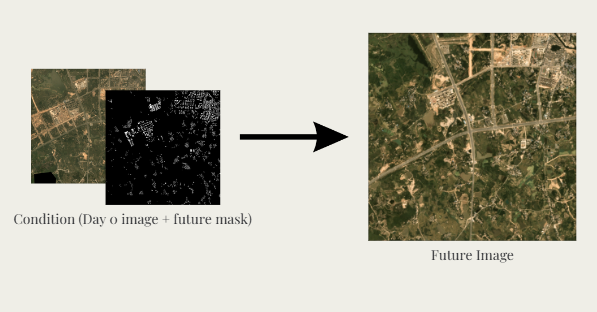

# Spatio-Temporal Remote Sensing Image Synthesis

## Introduction
The Spatio-Temporal Remote Sensing Image Synthesis project leverages cGANs and diffusion models to generate high-resolution satellite images. This pipeline enables precise and realistic image generation for various applications, including urban planning and environmental monitoring. By integrating guidance types such as semantic masks or text prompts, the models produce future time-series imagery based on past data inputs, maintaining high fidelity and semantic accuracy.

<div align="center">
  
</div>


## Table of Contents
- [Installation](#installation)
- [Repositry](#Repositry)
  - [Training](#training)
  - [Testing](#testing)
  - [Utilities](#utilities)
- [Configuration](#configuration)
- [Models](#models)
- [Metrics](#metrics)
- [License](#license)

## Installation

1. Clone the repository:
   ```
   git clone https://github.com/ShahmirAltamash/Spatio-Temporal-Remote_Sensing_Image_Synthesis.git
   cd Spatio-Temporal-Remote_Sensing_Image_Synthesis 
   ```

2. Install the required dependencies:
   ```
   pip install -r requirements.txt
   ```

## Repository

The repository is organized into three main folders, each dedicated to a specific aspect of the image synthesis pipeline:

#### 1. ControlNet Folder

This folder contains scripts for working with ControlNet, including:

- Data preprocessing to prepare inputs for ControlNet training
- ControlNet model training scripts
- Image generation utilities using trained ControlNet models

#### 2. cGAN Folder

This section houses implementations for conditional Generative Adversarial Networks (cGANs), including:

- Vanilla cGAN scripts
- Attention cGAN implementations
- Training routines for cGAN models
- Testing and evaluation scripts
- Image generation tools using trained cGAN models

#### 3. Dataset Folder

This folder focuses on dataset preparation, particularly for cGAN training:

- Download the dataset from this [link]( https://www.kaggle.com/datasets/amerii/spacenet-7-multitemporal-urban-development) 
- Scripts for processing and formatting raw data.
- The `spacenet-7-directory-metadata-extraction.ipynb` uses these downlaoded folders adn converts them into `.csv` format
- `spacenet-7-helper-functions.ipynb` only contains helper functions that we have used in the main code. Explore how the data is manipulated to get a better understanding.
- Use `dataset.py` to crease custom pytorch dataset classses for model. The SpaceNetDataset class returns concatenated intial image and segmentation mask, groundtruth of the future date and the index tensor.
- Utilities to organize data into the required structure for cGAN training

## Models
The `models.py` file contains architectures for discriminator and generators for GAN and Attention cGAN.

#### Discriminator
The Discriminator model is defined in `models.py` and consists of convolutional layers to classify real and generated images.

#### Generator
The Generator model is also defined in `models.py` and is responsible for generating images from input noise.

#### UNet
The UNet model is used as the generator. It can also be used for segmentation tasks and is defined in `models.py`.

#### Attention UNet
An enhanced version of the UNet with attention mechanisms to focus on important regions of the image.

### Training

To train the cGAN model, use the `train.py` script:

   ```bash
   python train.py
  ```

This script initializes the models, loads the dataset, and starts training. It also saves the model checkpoints and logs the training progress.
This is only for the cGAN model. For the Attention can use `train_att_gen.py`
```
python train_att_gen.py
```

## Metrics
Metrics for model evaluation are implemented in `metrics.py`. These include:

- LPIPS: Learned Perceptual Image Patch Similarity
- SSIM: Structural Similarity Index
- PSNR: Peak Signal-to-Noise Ratio
- FID: Frechet Inception Distance 
- F1 Score


### Testing

To test the models, use the `test.py` script:

   ```bash
   python test.py
   ```

This script loads the trained models and evaluates them on the test dataset, computing the above described metrics and optionally saving generated images.
For FID calculation use the `compute_fid.ipynb` file. To run this code you must have generated pictures from the both the models inside different zip folders and then give the path to the directies in the code.

## Utilities
Utility functions are provided in `utils.py`, which include functions for saving/loading checkpoints, saving model outputs, and more.

## Configuration
All the configurations for the training and testing process are located in the `config.py` file. Here are some key configurations:

- `DEVICE`: Device to run the computations (\`cuda\` or \`cpu\`).
- `LEARNING_RATE`: Learning rate for the optimizer.
- `BATCH_SIZE`: Batch size for data loaders.
- `NUM_EPOCHS`: Number of training epochs.
- `LOAD_MODEL`: Flag to load a pre-trained model.
- `SAVE_MODEL`: Flag to save the model during training.


## License
This project is licensed under the MIT License. See the LICENSE file for more details.
